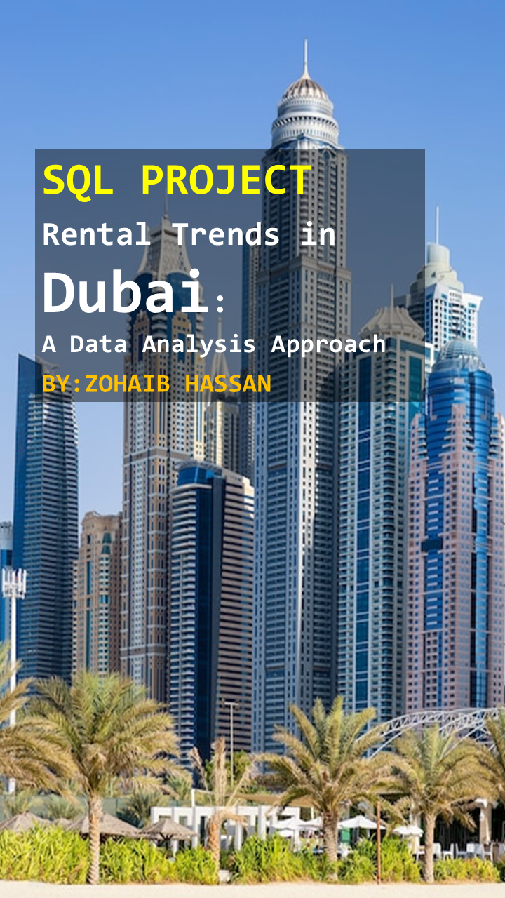

# Rental-Trends-in-Dubai-SQL-Project
## Project Overview
The project "Rental Trends in Dubai" aims to analyze and visualize the rental market trends in Dubai. The objective is to provide insights into the rental prices, identify patterns, and understand the factors influencing rental trends over time.

## Project Components
### Project Detail Document
This document will provide a comprehensive explanation of the project, including objectives, methodology, data sources, analysis techniques, and expected outcomes.
### Dataset
The dataset.xlsx file contains rental data for various properties in Dubai. This data will be used to analyze rental trends. The file is password protected with the passcode 332211.
### Screenshot File
This file will include screenshots of key analysis results and visualizations.
 
 

## FeedBack
If you have any feedback, suggestions, or questions about these projects, feel free to open an issue or reach out to me directly.

## Copyright Notice: 

All projects and content in this repository are the intellectual property of Zohaib Hassan. You are welcome to view, fork, and modify the code for personal or educational purposes. However, any commercial use or distribution of these projects, either in part or in whole, without explicit permission from the author, is strictly prohibited.

If you need access to the complete dashboard or have any questions, feel free to contact me via email or connect with me on LinkedIn.

For commercial usage or distribution permissions, please contact me at zohaib.atd92@gmail.com for licensing inquiries.

Thank you for respecting the author's rights and intellectual property.

Author: Zohaib Hassan
